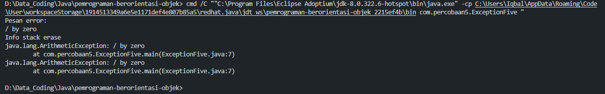

## Analist ExceptionFive

Exception adalah sebuah kelas maka hakikatnya ketika program berjalan dan muncul sebuah bug atau kesalahan maka bug tersebut dapat dianggap
sebuah object, sehingga ketika object ini di tampilkan dilayar maka java akan secara otomatis memanggil method toString yang terdapat
dalam object bertipe Exception ini.

---

### Try

Block program yang diyakini akan menimbulkan kesalahan maka ada di dalam block try and catch

### Catch1

kesalahan yang muncul akan dianggap sebagai object dan ditangkap catch kemudian di assign ke variable e dengan tipe Aritmathic Exception

### Catch2

Kemudian, kesalahan yang muncul akan dianggap sebagai object dan ditangkap catch kemudian di assign ke variable e dengan tipe Exception

### Output

Perintah setelah munculnya kesalahan pada block try and catch tidak akan dieksekusi, output dari kode program tersebut adalah;

---

