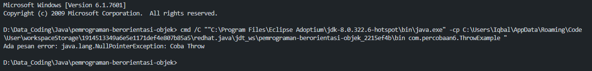

## Analist ThrowExample

Throw adalah keyword untuk melemparkan suatu bug yang dibuat secara manual. 

---

### Throw

Pada saat keyword throw t; akan melemparkan object bertipe NullPointerException yang merupakan subclass NullPointerException.

### Catch

Kemudian, keyword catch menangkap karena ada kesalahan.

### Output

output dari kode program tersebut adalah.

---

