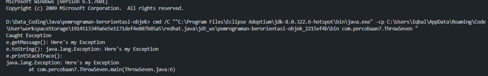

## Analist AnalisThrow

Throw adalah keyword untuk melemparkan suatu bug yang dibuat secara manual. 

---

### Try

Pada saat keyword throw new Exception("Here's my Exception"); akan melemparkan object bertipe Exception yang merupakan subclass Exception.

### Catch

Kemudian, keyword catch menangkap karena ada kesalahan. karena didalam catch terdapat keyword printStream maka output yang dihasilkan adalah;
- System.out.println("Caught Exception");
- System.out.println("e.getMassage(): "+e.getMessage());
- System.out.println("e.toString(): "+e.toString());
- System.out.println("e.printStackTrace():");

### Output

output dari kode program tersebut adalah.

---

