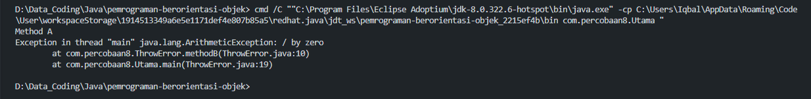

## Analist AnalisThrowsError

Keyword throws digunakan dalam suatu method atau kelas yang mungkin menghasilkan suatu kesalahan sehingga perlu ditangkap error-nya.

---

### Throws

Pada saat keyword throws pada method methodB(); dianggap memliki kesalahan yang harus ditangkap di try catch, tetapi di program tersebut
tidak ada block try catchnya kesalahan tersebut tidak akan dieksekusi programnya.

### Output

dibawah ini output dari kode program tersebut adalah.

---

